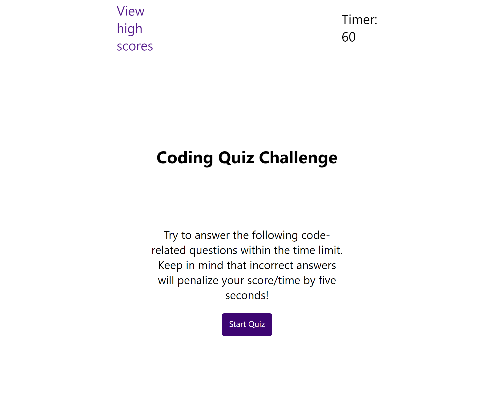

# Code Quiz / Module 04

## Description

This is a timed code quiz about Javascript that is helpful for studying & prepping for technical job interviews. High scores can be saved over time to track progress. Incorrect answers will decrease the time available to complete the quiz!

## Usage

Visit https://obelisk477.github.io/code-quiz/ and click the "Start Quiz" button to begin. Answer each question as quickly and as accurately as you can, noting that incorrect answers will decrease the amount of time you have left to complete the quiz. You will be notified with a message if you get an answer wrong. When you complete all of the questions, OR when time runs out, you will be directed to a screen where you can submit the score you earned to a high scores page. Clicking submit will take you to the high scores page; or, you can navigate there at any time via the link at the top left of the screen.

On the high scores screen, previous high scores as well as any recently submitted ones will be displayed. They can be cleared with the "Clear high scores" button, or you can return to the main quiz screen with the "Go back" button and try the quiz again.

## Credits

* MIT License generated by GitHub

## Screenshot

## License

Please refer to the LICENSE in the repo.